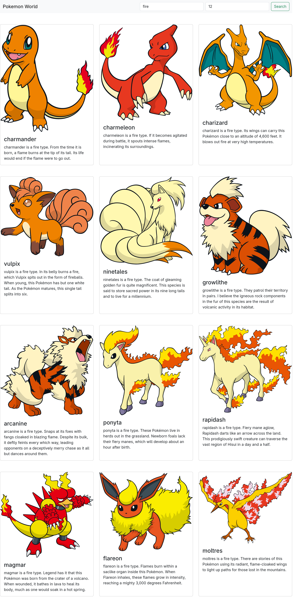

# Welcome to Pokemon World

> [! problem]
> Use the [PokeAPI](https://pokeapi.co/) to get the pokemon data based on user input
> inputs : type and quantity

## Approach

### how to build the description about about it

    - const res = https://pokeapi.co/api/v2/type/{type-name : electric}
    - name = res.pokemon\[0].pokemon.name {ex: "Pikachu"}
    - pokemon_url = res.pokemon\[0].pokemon.url {ex: https://pokeapi.co/api/v2/pokemon/25/}

### now get the url from there

    - const res = pokemon_url
    - image = res.sprites.other.dream_world.front_default} {ex: https://raw.githubusercontent.com/PokeAPI/sprites/master/sprites/pokemon/other/dream-world/25.svg}
    - type = res.types[0].type.name {ex: electric}
    - speciesUrl = res.species.url  {ex: https://pokeapi.co/api/v2/pokemon-species/25/}

### how to build description

    - const res = speciesUrl
    - description = res.flavor_text_entries[1].flavor_text.

    final-description = ${name} is a ${type}. {description} # remove spaces and \n.

### Images

#### fire-type

### #water-type

#### fighting-type

#### ghost-type

#### fairy-type

